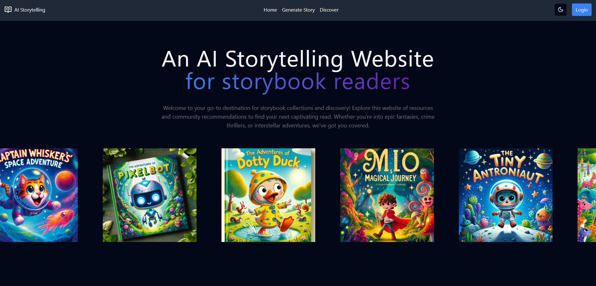
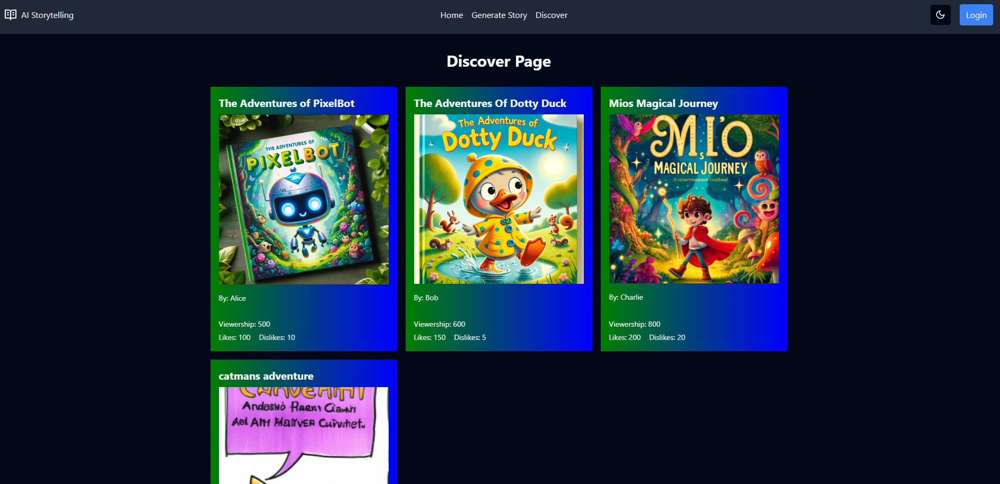
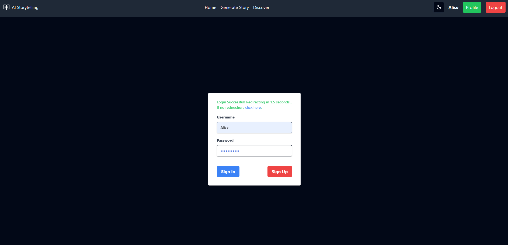
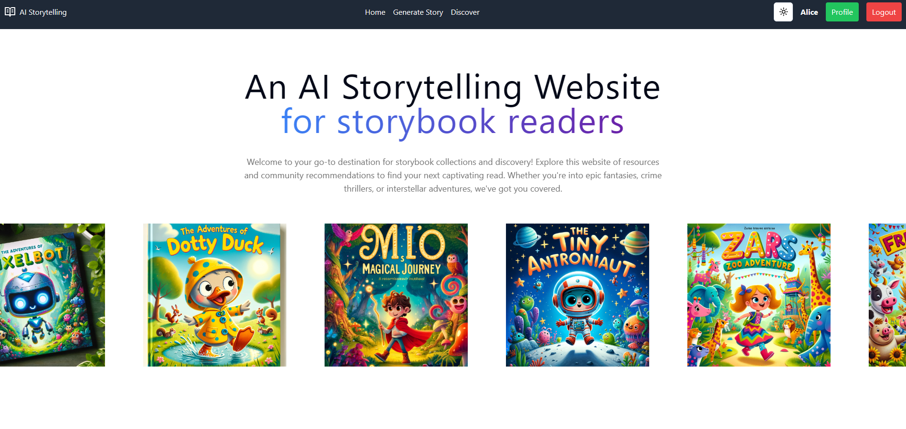
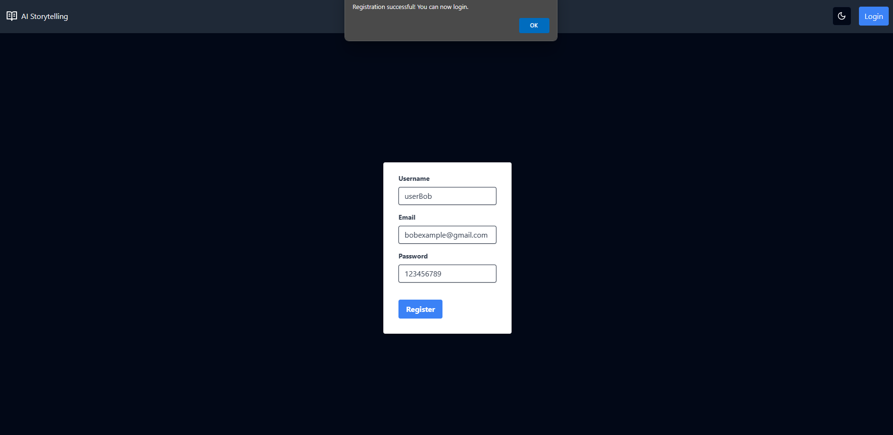
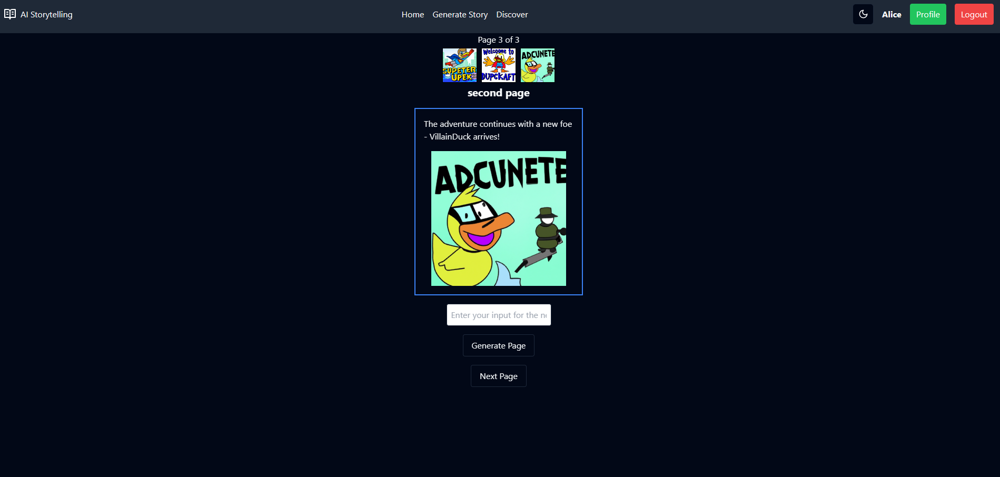

# Interactive-AI-Storytelling-Platform

## Current Features

#### Homepage



#### Discovery Page



#### Login Page



#### Light/Dark Mode



#### Registration



#### Generating a Storybook



## Tech Stack

- FrontEnd: ReactJS, TailWindCSS, Vite, Vitest (testing framework)
- Backend: Python, Flask, OpenAI API
- Database: PostgreSQL hosted on Heroku

## WorkFlow setup

Here is a step by step instruction guide to setup this project and run both the backend and frontend to get everything working.

#### Step 1. Pull From Main

```
git checkout main
git pull main
```

**Or to pull to your branch from main,  run these commands**

```
git checkout <yourbranchname>
git pull origin
git merge origin/main
```

### Step 2. Update Libraries

From the root directory, Navigate to your frontend folder and install the necessary frontend libraries and tools

```
cd frontend/frontend
npm install
```

From the root directory, Navigate to your backend folder and install the necessary backend libraries and tools

```
cd backend
pip install Flask Flask-CORS psycopg2-binary python-dotenv transformers requests tensorflow
pip install openai
```

### Step 3. Create a .env file for the backend

To run this project, you need to set up the necessary environment variables. Create a `.env` file in the `backend` directory with the following structure:

```
DB_HOST=<your_database_host>
DB_NAME=<your_database_name>
DB_USER=<your_database_username>
DB_PASSWORD=<your_database_password>
OPENAI_KEY="<your_api_key>"
```

### Step 4. Run the Backend and Frontend

From the root directory, Navigate to your frontend folder and run this command:

```
cd frontend/frontend
npm run dev
```

From the root directory, Navigate to your backend folder and run this command:

```
cd backend
flask run
```

### Note:

If Development server doesnt display the way it should, try a hard cache reset while on the local hosted page (chrome):

```
ctrl shift r
```

COMP602 - Software Development Practice

### Requirements

nodejs

python3

react

on windows: you may have to install
pip install tf-keras

## workflow

```
git checkout main
```

```
git pull
```

reinstall vite if necessary

```
git checkout -b new-branch
```

```
git add .
```

```
git commit -m "your commit message here"
```

```
git push -u origin new-branch
```

Make sure when revisiting the repo to work on the website, you follow these steps.

Add any libraries and their install commands to the README if you implemented any.
